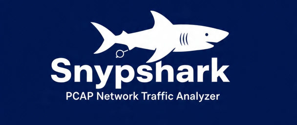

# 🕵️‍♂️ PCAP Network Traffic Analyzer – Snypshark

<div align="center">
  
</div>
<div align="center">


</div>

## 🌟 Features

### 📊 Advanced Data Analysis with Pandas
- **Structured Data Processing**: Convert raw packet data into organized DataFrames
- **Statistical Analysis**: Comprehensive traffic statistics and protocol distribution
- **Time Series Analysis**: Temporal pattern recognition and traffic timeline
- **Excel Export**: Generate professional reports in XLSX format
- **JSON Reports**: Structured data export for integration with other tools

### 🔍 Enhanced Security Detection
- **Port Scan Detection**: Automatic identification of suspicious scanning activity
- **Anomaly Detection**: Machine-learning ready anomaly scoring system
- **Pattern Matching**: Custom regex patterns for threat hunting
- **Top Talkers Analysis**: Identify heaviest traffic generators
- **Protocol Violation Detection**: Flag non-standard protocol usage

### 🎯 Comprehensive Protocol Support
- **Layer 2-7 Analysis**: Full OSI model coverage
- **TCP/UDP Analysis**: Deep packet inspection with flag analysis
- **DNS Monitoring**: Query/response correlation and suspicious domain detection
- **HTTP Analysis**: Method tracking, host analysis, and user agent monitoring
- **ICMP Typing**: Comprehensive ICMP type and code analysis
- **IP Statistics**: TTL analysis, fragmentation monitoring, and hop limit tracking

### 💻 Beautiful User Interface
- **Interactive CLI Menu**: Intuitive navigation with categorized options
- **Real-time Progress Bars**: Visual feedback during analysis
- **Color-coded Output**: Enhanced readability with emoji indicators
- **Clear Screen Management**: Professional terminal experience
- **Export Wizard**: Guided report generation process

## 📦 Installation

### Prerequisites
- Python 3.8 or higher
- 4GB RAM minimum (8GB recommended for large captures)
- 500MB disk space

### Quick Install
```bash
# Clone the repository
git clone https://github.com/joscalion04/snypshark.git
cd snypshark

# Create virtual environment (recommended)
python -m venv venv
source venv/bin/activate  # Linux/Mac
# or
venv\Scripts\activate     # Windows

# Install with pip
pip install -r requirements.txt

# Install in development mode (optional)
pip install -e .
```

### Development Installation
```bash
# For contributors and advanced users
pip install -r requirements-dev.txt

# Set up pre-commit hooks
pre-commit install
```

## 🚀 Usage

### Basic Analysis
```bash
python main.py
```
Follow the interactive prompts to select your PCAP file and analysis options.

### Example Workflow
1. **Launch the application**
2. **Drag and drop** your PCAP file when prompted
3. **View OSI layer overview** for quick insights
4. **Monitor real-time progress** during analysis
5. **Explore results** through interactive menus
6. **Export findings** to Excel or JSON formats

## 📊 Sample Output

```bash
════════════════════════════════════════════════════════════════
🎮 MAIN ANALYSIS MENU
════════════════════════════════════════════════════════════════
1. 📦 Packet Statistics
2. 🌐 Protocol Analysis
3. 🔍 Security Findings
4. 📊 Advanced Pandas Analysis
5. 💾 Export Results
0. 🚪 Exit
════════════════════════════════════════════════════════════════

🎯 Select an option (0-5): 4
```

## 🏗️ Project Structure

```
snypshark/
├── analyzer/
│   ├── __init__.py
│   ├── analyzer.py              # Core analysis engine
│   ├── data_analysis/      
│   |   └── pandas_analyzer.py       # Advanced data analysis
│   ├── protocol_handlers/       # Protocol-specific processors
│   │   ├── tcp_handler.py
│   │   ├── udp_handler.py
│   │   ├── ip_handler.py
│   │   ├── icmp_handler.py
│   │   ├── dns_handler.py
│   │   ├── http_handler.py
│   │   └── dhcp_handler.py
│   ├── utils/                   # Utility modules
│   │   ├── pattern_matcher.py
│   │   ├── progress.py
│   │   └── __init__.py
│   └── ui/                      # User interface
│       ├── menu.py
│       ├── osi_layers.py
│       └── __init__.py
├── data/                        # Sample PCAP files
├── tests/                       # Test suite
├── main.py                      # CLI entry point
├── requirements.txt             # Production dependencies
├── requirements-dev.txt         # Development dependencies
├── setup.py                     # Package configuration
└── README.md                    # This file
```

## 🔧 Dependencies

### Core Dependencies
```txt
pyshark>=0.5.0          # PCAP file parsing
pandas>=1.5.0           # Data analysis and manipulation
numpy>=1.24.0           # Numerical computing
openpyxl>=3.1.0         # Excel export functionality
colorama>=0.4.0         # Terminal color support
python-dateutil>=2.8.0  # Date and time handling
```

### Development Dependencies
```txt
pytest>=7.0.0           # Testing framework
pytest-cov>=4.0.0       # Test coverage reporting
pytest-mock>=3.10.0     # Mocking for tests
black>=23.0.0           # Code formatting
flake8>=6.0.0           # Code linting
isort>=5.12.0           import sorting
mypy>=1.0.0             # Static type checking
pre-commit>=3.0.0       # Git pre-commit hooks
```

## 🧪 Testing

```bash
# Run all tests
pytest

# Run with coverage report
pytest --cov=analyzer

# Run specific test module
pytest tests/test_analyzer.py -v
```

## 📋 Supported Analysis Types

### Protocol Analysis
- **TCP**: Flag analysis, stream tracking, port statistics
- **UDP**: Port distribution, packet size analysis
- **IP**: TTL analysis, fragmentation, protocol distribution
- **ICMP**: Type/code analysis, error message tracking
- **DNS**: Query/response correlation, domain analysis
- **HTTP**: Method analysis, host tracking, status codes
- **DHCP**: Message type analysis, lease monitoring

### Security Analysis
- **Port Scan Detection**: SYN flood and stealth scan identification
- **Anomaly Detection**: Statistical outlier detection
- **Pattern Matching**: Custom regex pattern matching
- **Behavior Analysis**: Traffic baseline deviation

### Data Analysis
- **Time Series**: Traffic patterns over time
- **Top N Analysis**: Top talkers, protocols, ports
- **Statistical Summary**: Mean, median, standard deviation
- **Correlation Analysis**: Protocol and service relationships

## 🎨 UI Features

- **Interactive Menus**: Categorized navigation system
- **Real-time Progress**: Animated progress bars with ETA
- **Color Coding**: Visual distinction of information types
- **Clear Screen Management**: Professional terminal experience
- **Contextual Help**: In-line guidance and tooltips

## 📁 Export Capabilities

### Excel Export
- Multiple worksheets with detailed analysis
- Formatted tables and charts-ready data
- Professional styling and branding
- Automated report generation

### JSON Export
- Machine-readable format
- Integration with other security tools
- Structured data for further processing
- Complete analysis results preservation

## 🔮 Roadmap

### Short-term Goals
- [ ] Real-time network capture support
- [ ] Enhanced visualization capabilities
- [ ] Custom rule engine for threat detection
- [ ] Integration with threat intelligence feeds

### Long-term Vision
- [ ] Machine learning anomaly detection
- [ ] Cloud-based analysis platform
- [ ] Mobile application companion
- [ ] API for automated analysis

## 🤝 Contributing

We welcome contributions! Please see our [Contributing Guidelines](CONTRIBUTING.md) for details.

1. Fork the repository
2. Create a feature branch (`git checkout -b feature/amazing-feature`)
3. Commit your changes (`git commit -m 'Add amazing feature'`)
4. Push to the branch (`git push origin feature/amazing-feature`)
5. Open a Pull Request

## 📝 License

This project is licensed under the MIT License - see the [LICENSE](LICENSE) file for details.

## 🆘 Support

- 📖 [Documentation Wiki](https://deepwiki.com/Joscalion04/Snypshark)
- 🐛 [Issue Tracker](https://github.com/joscalion04/snypshark/issues)
- 💬 [Discussions](https://github.com/joscalion04/snypshark/discussions)
- 📧 Email: joscalion04@gmail.com

## 👥 Authors

- **Joseph Leon (Joscalion04)** - Initial work and maintenance

## 🙏 Acknowledgments

- Inspired by Wireshark and network forensic tools
- Built with amazing open-source Python libraries
- Community contributors and testers

---

<div align="center">

**Happy hunting!** 🕵️‍♂️✨

</div>
